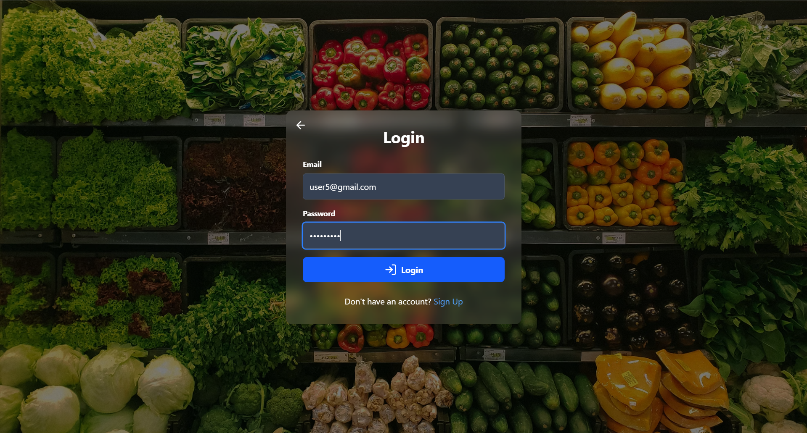
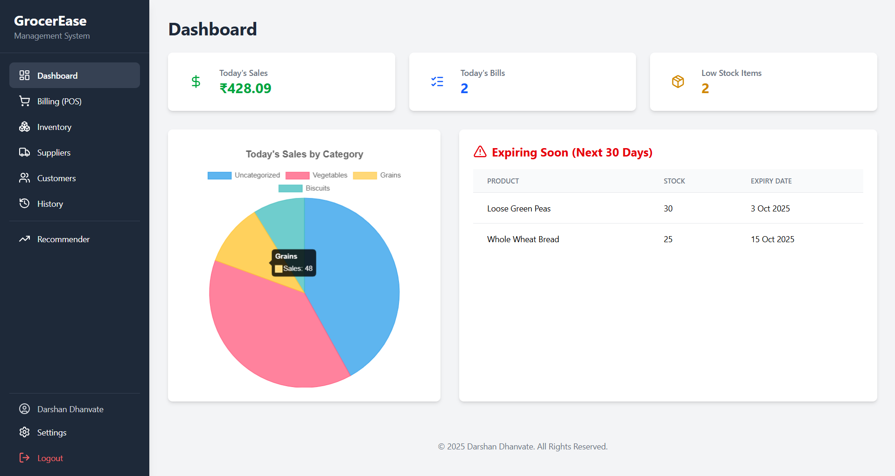
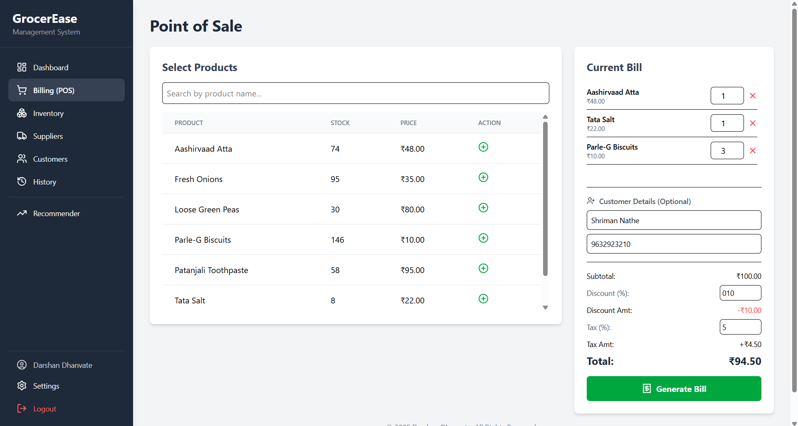
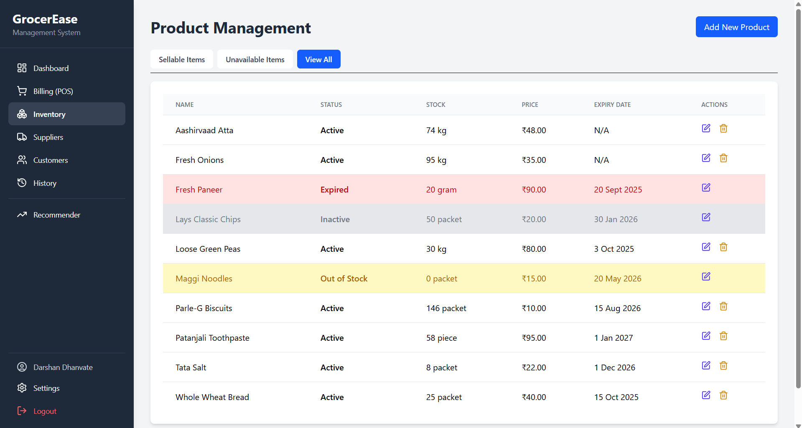
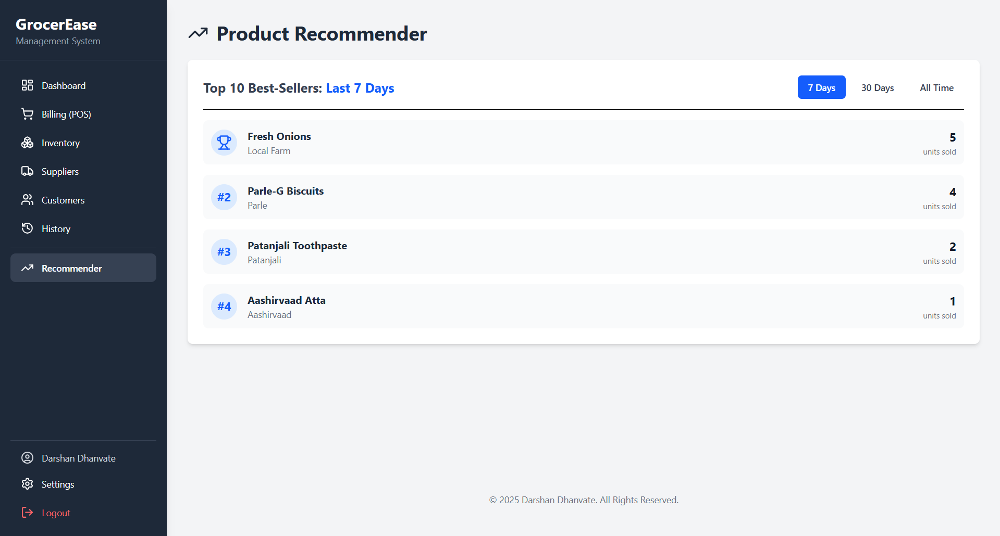

# GrocerEase - Inventory Management & Billing System


GrocerEase is a comprehensive, full-stack web application designed to modernize small to medium-sized grocery shops. It provides a complete solution for inventory management, point-of-sale (POS) billing, and insightful business analytics, all wrapped in a secure, user-friendly interface.


## ✨ Key Features

* **Secure Authentication:**
    * User signup and login system with password hashing (`bcryptjs`).
    * Stateful sessions using JSON Web Tokens (JWT) to protect all sensitive data and API routes.

* **Interactive Dashboard:**
    * At-a-glance KPIs for today's sales, total bills, and low-stock items.
    * A dynamic pie chart visualizing daily sales by product category.
    * A clickable "Low Stock" card that opens a modal showing exactly which items need reordering.

* **Advanced Inventory Management:**
    * Full CRUD (Create, Read, Update, Delete) functionality for products.
    * **Smart Deletion:** "Deactivate" (soft delete) products to preserve sales history.
    * **Safe Permanent Deletion:** Permanently delete products only if they have no associated sales records.
    * **Status Tracking:** Filter and view products by their status: `Sellable`, `Unavailable` (Inactive, Out of Stock, Expired), or `All`.

* **Point of Sale (POS) & Billing:**
    * A fast, searchable product list that only shows sellable (in-stock, non-expired) items.
    * Dynamic cart with quantity adjustments and real-time total calculations.
    * Optional capture of customer name and mobile number, with automatic creation/linking of customer records.
    * Printable receipt generation after each sale.

* **History & Analytics:**
    * A dedicated **Transaction History** page with a complete log of all past bills.
    * Search functionality for history by both Bill ID and Customer Name.
    * A **Product Recommender** system to show top-selling items by time period (Last 7 Days, 30 Days, All Time).

* **Customer & Supplier Management:**
    * View a complete list of all customers created through the POS system.
    * Full CRUD functionality for suppliers with soft-delete to maintain data integrity.

* **Admin Zone:**
    * A secure settings page with a "Clear Transaction History" option (with multiple safety confirmations) to reset all sales and customer data.

## 📸 Screenshots

| Login & POS | Dashboard & Inventory |
| :---: | :---: |
| **Login Page** <br>  | **Dashboard** <br>  |
| **Point of Sale** <br>  | **Inventory Management** <br>  |
| **Product Recommender** |
|  |

## 🛠️ Technology Stack

* **Frontend:**
    * React (with Vite)
    * React Router for routing
    * Tailwind CSS for styling
    * Chart.js for data visualization
    * Axios for API communication
    * Lucide React for icons
* **Backend:**
    * Node.js
    * Express.js for the API framework
    * MySQL2 for database connection
    * JSON Web Tokens (JWT) for authentication
    * bcryptjs for password hashing
    * dotenv for environment variables
* **Database:**
    * MySQL

## 🚀 Getting Started

To get a local copy up and running, follow these simple steps.

### Prerequisites

* Node.js (v18 or later)
* MySQL Server

### Backend Setup

1.  **Clone the repository:**
    ```sh
    git clone [https://github.com/your-username/your-repo-name.git](https://github.com/your-username/your-repo-name.git)
    cd your-repo-name/backend
    ```
2.  **Install NPM packages:**
    ```sh
    npm install
    ```
3.  **Set up the Database:**
    * Ensure your MySQL server is running.
    * Run the `schema.sql` file (located in the project root) in your MySQL client to create the database and all tables.
4.  **Configure Environment Variables:**
    * Create a file named `.env` in the `backend` root folder.
    * Copy the contents of `.env.example` into it and fill in your MySQL password and a JWT secret.
    ```env
    # .env.example
    DB_HOST=localhost
    DB_USER=root
    DB_PASSWORD=YOUR_MYSQL_PASSWORD
    DB_DATABASE=grocery_store
    JWT_SECRET=your_super_secret_string
    ```
5.  **Start the Backend Server:**
    ```sh
    npm start 
    # Or for development with nodemon:
    # nodemon server.js
    ```
    The backend will be running on `http://localhost:3001`.

### Frontend Setup

1.  **Navigate to the frontend directory:**
    ```sh
    cd ../frontend 
    ```
2.  **Install NPM packages:**
    ```sh
    npm install
    ```
3.  **Start the Frontend Development Server:**
    ```sh
    npm run dev
    ```
    The application will be accessible at `http://localhost:5173` (or another port if 5173 is busy).

## 📜 License

Distributed under the MIT License. See `LICENSE` for more information.